  

# 🚨 Awesome Incident Management Platform 🛠️

   

> **A curated list of enterprise SaaS platforms and open-source GitHub projects for EHS (Environment, Health & Safety), IT/SRE incident response, on-call scheduling, alerting, post-incident learning, and operational resilience.** 🚀

---

## 💡 Market Overview & Industry Insights 📊

> 📈 **Estimated Market Size & Structure**:  
> The global **Incident Management & Operational Reliability** sector (encompassing IT Incident Response, SRE Incident Management, and Enterprise EHS Risk Compliance) is estimated at **~$4.2 Billion USD** and is projected to reach **~$9.8 Billion USD by 2030**.  
>  
> - **IT/SRE Incident Management**: **Moderately Concentrated** (dominated by major platforms like PagerDuty and Atlassian, with modern fast-growing Slack-native alternatives like Rootly and incident.io gaining significant traction).  
> - **EHS (Environment, Health & Safety) Incident Software**: **Highly Fragmented** (composed of specialized enterprise compliance suites such as Sphera, Enablon, Cority, and Intelex tailored for heavily regulated industries).

---

## 📋 Table of Contents 📌

- [🏢 SaaS/Hosted Platforms](#-saashosted-platforms)
- [🔓 Open-Source GitHub Projects](#-open-source-github-projects)
- [🤝 How to Contribute](#-how-to-contribute)
- [💖 Support & Sponsorship](#-support--sponsorship)
- [📈 Star History](#-star-history)
- [⚠️ Disclaimer](#%EF%B8%8F-disclaimer)

---

## 🏢 SaaS/Hosted Platforms

Top commercial solutions for IT/SRE operational incidents and enterprise EHS compliance sorted by company valuation/annual revenue (descending).

| Platform 🌐 | Category 🏷️ | Est. Valuation / Revenue 💰 | Starting Pricing 💵 | Free Tier / Trial Limit ⏳ | Description 📝 |
| :--- | :--- | :--- | :--- | :--- | :--- |
| **[PagerDuty](https://www.pagerduty.com/)** | IT / SRE | ~$1.1B Valuation / ~$500M Revenue | $21 / user / month (Professional) | **Free Tier**: Max 5 users (basic alerting & scheduling) | Leading digital operations & incident management platform for on-call and escalation response orchestration. |
| **[Enablon (Wolters Kluwer)](https://www.enablon.com/)** | EHS Safety | ~$600M Estimated Valuation | ~$15,000 / year (Enterprise Quote) | **No Free Tier**: 14-day enterprise sales demo trial | Enterprise EHS and operational risk platform used for incident management, compliance, and governance at scale. |
| **[Sphera](https://www.sphera.com/)** | EHS Safety | ~$1.4B Acquired Valuation | ~$12,000 / year (Enterprise Quote) | **No Free Tier**: 14-day guided product demo | Enterprise operational risk and EHS platform strong in process safety and high-hazard industry incident management. |
| **[Jira Service Management](https://www.atlassian.com/software/jira/service-management)** | IT / SRE | Part of Atlassian ($40B+ Market Cap) | $22 / agent / month (Standard) | **Free Tier**: Up to 3 agents, 2 GB storage | ITSM & incident response platform with alerting, postmortems, and workflow integration. |
| **[Intelex](https://www.intelex.com/)** | EHS Safety | ~$500M Acquired Valuation | ~$10,000 / year (Enterprise Quote) | **No Free Tier**: 14-day tailored demo trial | Configurable EHSQ platform widely used for safety incident management, audits, risk, and quality workflows. |
| **[Cority](https://www.cority.com/)** | EHS Safety | ~$450M Estimated Valuation | ~$9,000 / year (Enterprise Quote) | **No Free Tier**: 14-day executive demo trial | Enterprise EHS platform with deep occupational health, industrial hygiene, and incident management capabilities. |
| **[VelocityEHS](https://www.velocityehs.com/)** | EHS Safety | ~$400M Estimated Valuation | ~$8,000 / year (Enterprise Quote) | **No Free Tier**: 14-day structured demo trial | Connected EHS platform covering safety, ergonomics, chemical management, and incident management. |
| **[BigPanda](https://www.bigpanda.io/)** | IT / SRE | ~$1.2B Valuation | ~$25,000 / year (Enterprise Quote) | **No Free Tier**: 14-day interactive demo trial | AIOps and incident correlation platform that aggregates alerts and automates operational response. |
| **[incident.io](https://incident.io/)** | IT / SRE | ~$200M Valuation | $16 / user / month (Pro Plan) | **Free Trial**: 14-day full access trial | Modern Slack-native incident management platform designed for fast incident declaration and retrospectives. |
| **[Rootly](https://rootly.com/)** | IT / SRE | ~$150M Valuation | $14 / user / month (Pro Plan) | **Free Trial**: 14-day full access trial | Incident management platform popular for Slack/Teams-centric response, automated runbooks, and postmortems. |
| **[FireHydrant](https://firehydrant.com/)** | IT / SRE | ~$100M Valuation | $19 / user / month (Standard Plan) | **Free Tier**: Up to 5 users with basic incident tracking | Incident response management platform focused on structured workflows, automated runbooks, and retrospectives. |
| **[Squadcast](https://www.squadcast.com/)** | IT / SRE | ~$30M Valuation | $9 / user / month (Pro Plan) | **Free Tier**: Up to 5 users with basic on-call & alerting | Incident management and on-call platform with reliability-focused workflows for engineering teams. |
| **[EHS Insight](https://www.ehsinsight.com/)** | EHS Safety | ~$50M Valuation | $350 / month (Standard Base) | **Free Trial**: 14-day full platform access trial | Cloud EHS software focused on incidents, observations, audits, and corrective action tracking. |
| **[Origami Risk](https://www.origamirisk.com/)** | EHS / Risk | ~$350M Estimated Valuation | ~$10,000 / year (Enterprise Quote) | **No Free Tier**: Guided enterprise demo trial | Risk and claims/incident management platform used by insurers, captives, and self-insured organizations. |

---

## 🔓 Open-Source GitHub Projects

Curated open-source incident management, on-call alerting, status page, and AIOps repositories sorted by **GitHub_Stars** (descending).

| Project 📦 | Stars ⭐ | Description 📝 |
| :--- | :--- | :--- |
| **[Cachet](https://github.com/cachethq/cachet)** |  | An open-source self-hosted status page system for tracking outages and system incidents. |
| **[Keep](https://github.com/keephq/keep)** |  | Open-source AIOps and incident management platform for alert correlation and workflow automation. |
| **[awesome-incident-response](https://github.com/meirwah/awesome-incident-response)** |  | A curated list of awesome cybersecurity and operational incident response tools and resources. |
| **[OneUptime](https://github.com/OneUptime/oneuptime)** |  | Complete open-source observability, status page, on-call alerting, and incident management suite. |
| **[Grafana OnCall](https://github.com/grafana/oncall)** |  | Developer-friendly open-source on-call management tool for alert routing, scheduling, and escalations. |
| **[TheHive](https://github.com/TheHive-Project/TheHive)** |  | Scalable 4-in-1 open-source Security Incident Response Platform (SIRP) for SOCs and security teams. |
| **[Regen](https://github.com/FluidifyAI/Regen)** |  | Open-source on-call and AI incident response post-mortem platform; self-hosted alternative to PagerDuty. |
| **[ERPNext](https://github.com/frappe/erpnext)** |  | Open-source ERP platform featuring customizable safety management, incident logging, and corrective action modules. |

---

## 🤝 How to Contribute

Contributions are highly welcome! 🌟 Follow these simple steps:

1. 🍴 **Fork** the repository.
2. 📝 **Add or update** entries in `README.md` following the tabular layout and formatting rules.
3. 🔗 Ensure all web links, Stars_Badges, and pricing descriptions are accurate.
4. 🚀 **Submit a Pull Request** with a clear explanation of your changes.

---

## 💖 Support & Sponsorship

If you find this repository useful for your SRE team or EHS safety operations, please consider supporting the project:

- ⭐ **Star** this repository on GitHub to show your appreciation!
- 🔀 **Fork** and share it with your engineering and DevOps network.
- ☕ **Buy me a coffee**: Sponsor this work directly via the [GitHub Sponsor Dashboard](https://github.com/sponsors/ishandutta2007). Thank you for keeping open source awesome! 🙌

---

## 📈 Star History

---

## ⚠️ Disclaimer

- This repository is a **community-curated list** — it is not exhaustive and does not constitute formal endorsement.
- EHS incident systems support critical regulatory compliance and workplace safety obligations; IT incident systems directly impact cloud infrastructure reliability. 
- Always perform your own diligence before selecting commercial platforms or self-hosting open-source tools.

---

  <b>Made with ❤️ for SREs, DevOps Engineers, and EHS Safety Leaders worldwide.</b>

